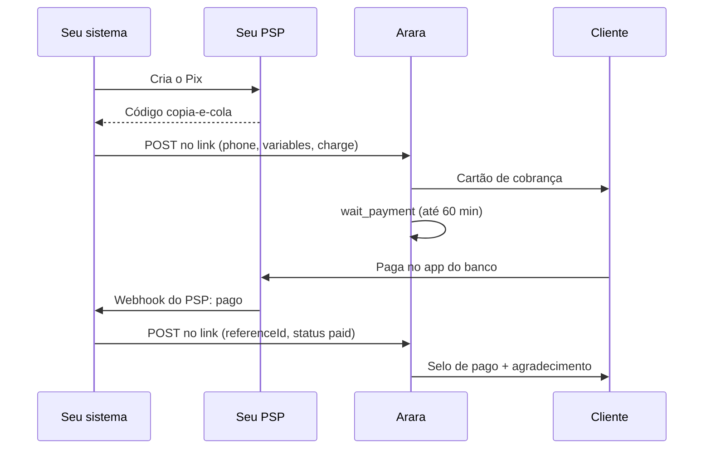

Toda automação com gatilho `webhook` tem um link só dela. O seu sistema faz `POST` nesse link pra iniciar a automação, já com a cobrança, e depois faz outro `POST` no mesmo link pra avisar se o cliente pagou.

Com isso a automação sabe "pagou / não pagou" sem você mapear variáveis nem chamar outra API.

```
POST https://api.ararahq.com/hooks/a/ara_hook_…
```

Copie o link pronto na tela da automação; o token tem 43 caracteres depois de `ara_hook_`.

<Warning>
O link não usa API key: o `token` na URL é a credencial. Trate o link como um segredo. Se ele vazar, gere outro no dashboard, na tela da automação. O link antigo para de funcionar na hora.
</Warning>

## Exemplo completo

Assinatura mensal por Pix. O seu sistema gera o Pix no seu PSP e entrega pra Arara; a automação cobra, espera e agradece. Se nada chegar em 1 hora, manda um lembrete.



### 1. A automação

```bash
curl -X POST https://api.ararahq.com/v1/automations \
  -H "Authorization: Bearer ara_live_xxx" \
  -H "Content-Type: application/json" \
  -d '{
    "name": "Cobrança do plano mensal",
    "trigger": "webhook",
    "steps": [
      {
        "type": "message",
        "config": {
          "templateId": "0b8f6c1e-7a52-4a1b-9a0e-3f2d6c9e1a44",
          "variables": ["nome"]
        }
      },
      {
        "type": "wait_payment",
        "config": { "timeoutMinutes": 60 },
        "branches": {
          "paid": [
            {
              "type": "message",
              "config": { "templateId": "9c4e1a7b-2d33-4b6f-8e15-7f0a1b2c3d4e", "variables": ["nome"] }
            },
            { "type": "tag", "config": { "tag": "pagou" } }
          ],
          "unpaid": [
            {
              "type": "message",
              "config": { "templateId": "5d2a9b7c-1e44-4f0a-8c3b-6a7e2d1f9b10", "variables": ["nome"] }
            }
          ]
        }
      }
    ]
  }'
```

O primeiro template é um [template de cobrança](/cobrancas#fora-da-janela-template-de-cobrança). Como a cobrança vem no corpo do `POST`, o passo não precisa do molde `charge` com `{{variaveis}}`: ele usa a cobrança recebida.

A automação nasce desligada. Ligue com `PUT /v1/automations/{id}/active` e `{ "active": true }`. Depois copie o link na tela da automação, no dashboard.

### 2. Iniciar com a cobrança

```bash
curl -X POST https://api.ararahq.com/hooks/a/SEU_TOKEN \
  -H "Content-Type: application/json" \
  -H "Idempotency-Key: pedido-1042" \
  -d '{
    "phone": "5588999990000",
    "variables": { "nome": "Maria" },
    "charge": {
      "referenceId": "pedido-1042",
      "method": "pix",
      "pixCode": "000201...",
      "pixKey": "39580525000189",
      "pixKeyType": "CNPJ",
      "merchantName": "Loja Exemplo",
      "amountCents": 5990,
      "description": "Plano mensal",
      "expiresAt": "2026-09-21T12:00:00Z"
    }
  }'
```

```json
{ "runId": "7c1d2e90-4b3a-4c8e-9f21-5a6b7c8d9e01", "status": "started" }
```

### 3. Avisar que pagou

Quando o webhook do seu PSP confirmar o pagamento:

```bash
curl -X POST https://api.ararahq.com/hooks/a/SEU_TOKEN \
  -H "Content-Type: application/json" \
  -d '{ "referenceId": "pedido-1042", "status": "paid" }'
```

```json
{ "referenceId": "pedido-1042", "status": "paid", "cardUpdated": true, "runResumed": true }
```

O cartão ganha o selo de pago e a execução segue pelo caminho `paid`. Se esse `POST` não chegar em 60 minutos, ela segue por `unpaid`.

## Os dois corpos

O link aceita dois corpos. Com `phone`, inicia uma execução. Com `referenceId` e `status` na raiz, atualiza o pagamento.

### Iniciar

| Campo | Regra |
|---|---|
| `phone` | Telefone do cliente, com DDI: `5588999990000`. |
| `variables` | Opcional. Objeto com as variáveis da execução, usadas como `{{nome}}` nos passos. |
| `charge` | Opcional. A cobrança que o passo de cobrança da automação vai enviar. |
| `charge.referenceId` | Seu número da cobrança. É com ele que você avisa o pagamento depois. |
| `charge.method` | `pix` ou `link`. |
| `charge.pixCode`, `charge.pixKey`, `charge.pixKeyType`, `charge.merchantName` | Só em `pix`: o copia-e-cola, a chave, o tipo da chave e o nome do recebedor. |
| `charge.paymentLink` | Só em `link`: a URL de pagamento. Substitui os campos de Pix. |
| `charge.amountCents` | Valor em centavos. |
| `charge.description` | O que está sendo cobrado. |
| `charge.expiresAt` | Opcional. Data ISO 8601. Quando passa, a cobrança vira `EXPIRED` sozinha. |

Resposta `202`:

| Campo | Descrição |
|---|---|
| `runId` | A execução criada. Aparece no [histórico de execuções](/automacoes-com-resposta#histórico-de-execuções). |
| `status` | `started` ou `duplicate`. |

Valem as mesmas [conferências do envio pela API](/cobrancas#o-que-a-arara-confere-antes-de-enviar). A Arara **não guarda** o código Pix nem o link depois do envio.

Sem `charge`, o link só inicia a automação com as `variables`.

### Atualizar o pagamento

| Campo | Regra |
|---|---|
| `referenceId` | O mesmo enviado em `charge.referenceId`. A cobrança precisa ter sido enviada **por esta automação**. |
| `status` | `paid`, `failed`, `canceled` ou `expired`. |

Resposta `200`:

| Campo | Descrição |
|---|---|
| `referenceId` | A cobrança atualizada. |
| `status` | O status gravado. |
| `cardUpdated` | `true` quando o cartão no WhatsApp foi atualizado. `false` quando a janela de 24h está fechada. O status muda do mesmo jeito. |
| `runResumed` | `true` quando havia uma execução parada em `wait_payment` e ela seguiu. |

## O passo `wait_payment`

"Esperar pagamento". Para a execução até a cobrança ter um resultado, ou até o prazo acabar.

| Campo | Regra |
|---|---|
| `config.timeoutMinutes` | Prazo de espera, de `1` a `43200` (30 dias). |
| `config.referenceId` | Opcional. Sem ele, vale a cobrança mais recente da execução. |
| `branches` | Duas chaves reservadas: `paid` e `unpaid`. |

| Chave | Quando a execução segue por ela |
|---|---|
| `paid` | A cobrança foi paga. |
| `unpaid` | O prazo acabou, ou a cobrança ficou `failed`, `canceled` ou `expired`. |

Se a cobrança já está paga quando a execução chega no passo, ela vai direto pra `paid`.

Enquanto a execução espera, as mensagens do cliente seguem o caminho normal (Brain ou caixa de entrada). O passo não consome as respostas, diferente do [`question`](/automacoes-com-resposta).

No histórico, a execução fica com status `WAITING_PAYMENT` e gera os eventos `PAYMENT_WAITING`, `PAYMENT_CONFIRMED` e `PAYMENT_NOT_CONFIRMED`.

## Assinatura (opcional)

Por padrão, quem tem o link consegue chamar. Pra exigir prova de que a chamada veio do seu sistema, ligue **Exigir assinatura** na tela da automação e copie o secret. Ele aparece **uma vez só**.

<Tip>
Ligue a assinatura sempre que o link for usado pra marcar cobrança como paga.
</Tip>

Com a assinatura ligada, toda chamada precisa do header:

```
X-Arara-Signature: sha256=<hex>
```

`<hex>` é o HMAC-SHA256 do **corpo cru** da requisição, com o secret como chave, em hexadecimal. Assine exatamente os bytes que você envia: serialize o JSON uma vez, assine essa string e mande a mesma string.

<CodeGroup>
```javascript Node.js
import crypto from 'node:crypto'

const body = JSON.stringify({ referenceId: 'pedido-1042', status: 'paid' })
const signature = crypto
  .createHmac('sha256', process.env.ARARA_HOOK_SECRET)
  .update(body)
  .digest('hex')

await fetch(process.env.ARARA_HOOK_URL, {
  method: 'POST',
  headers: {
    'Content-Type': 'application/json',
    'X-Arara-Signature': `sha256=${signature}`,
  },
  body,
})
```

```python Python
import hashlib, hmac, json, os
import requests

body = json.dumps({"referenceId": "pedido-1042", "status": "paid"}).encode()
signature = hmac.new(os.environ["ARARA_HOOK_SECRET"].encode(), body, hashlib.sha256).hexdigest()

requests.post(
    os.environ["ARARA_HOOK_URL"],
    data=body,
    headers={
        "Content-Type": "application/json",
        "X-Arara-Signature": f"sha256={signature}",
    },
    timeout=10,
)
```

```php PHP
$body = json_encode(['referenceId' => 'pedido-1042', 'status' => 'paid']);
$signature = hash_hmac('sha256', $body, getenv('ARARA_HOOK_SECRET'));

$ch = curl_init(getenv('ARARA_HOOK_URL'));
curl_setopt_array($ch, [
    CURLOPT_POST => true,
    CURLOPT_POSTFIELDS => $body,
    CURLOPT_HTTPHEADER => [
        'Content-Type: application/json',
        'X-Arara-Signature: sha256=' . $signature,
    ],
    CURLOPT_RETURNTRANSFER => true,
    CURLOPT_TIMEOUT => 10,
]);
curl_exec($ch);
```
</CodeGroup>

Guarde o link e o secret em variáveis de ambiente, nunca no código nem no front-end.

Pela API: `PUT /v1/automations/{id}/hook/signature` com `{ "enabled": true }` liga a assinatura, e `POST /v1/automations/{id}/hook/regenerate` gera um link novo.

## Idempotência

- **Iniciar:** mande o header `Idempotency-Key`. Sem ele, o `charge.referenceId` faz o papel. Chamada repetida responde `202` com `"status": "duplicate"` e não envia outra cobrança.
- **Atualizar:** repetir o mesmo status responde `200` com `{ "status": "unchanged" }`. Pode reenviar sem medo quando o seu PSP repetir o webhook.
- Um status final diferente depois de outro status final é recusado com `CHARGE_ALREADY_SETTLED`.

## Erros

Todo erro segue o formato padrão, com o código em `error.code`:

```json
{ "error": { "code": "HOOK_SIGNATURE_INVALID", "message": "...", "details": {} } }
```

| Status | `error.code` | Quando |
|---|---|---|
| 404 | `HOOK_NOT_FOUND` | O token não existe, o link foi regenerado, ou a automação não usa mais o gatilho de webhook. A resposta é a mesma nos três casos. |
| 401 | `HOOK_SIGNATURE_INVALID` | A assinatura é exigida e o header está ausente ou não confere com o corpo. |
| 400 | `HOOK_PAYLOAD_INVALID` | O corpo não é nenhum dos dois formatos. A mensagem explica os dois. |
| 400 | `INVALID_CHARGE` | A cobrança não passou nas conferências (Pix inválido, valor diferente do Pix, `referenceId` já usado na conta...). |
| 413 | `HOOK_PAYLOAD_TOO_LARGE` | Corpo acima de 64 KB. |
| 409 | `AUTOMATION_INACTIVE` | A automação está desligada. Só é informado depois que a assinatura confere. |
| 404 | `CHARGE_NOT_FOUND` | Não existe cobrança com esse `referenceId` enviada por esta automação. |
| 409 | `CHARGE_ALREADY_SETTLED` | A cobrança já tem um status final diferente do enviado. |
| 429 | `HOOK_RATE_LIMITED` | Passou de 300 chamadas por minuto nesta automação. Respeite o header `Retry-After`. |

`paid`, `canceled` e `expired` são finais. `failed` não é: uma cobrança que falhou ainda pode ser paga.

Veja a [lista de erros](/erros).

## Com n8n

São dois nós **HTTP Request**, os dois apontando pro mesmo link.

1. **Iniciar.** Depois do nó que cria o Pix no seu PSP: método `POST`, URL do link, corpo JSON com `phone`, `variables` e `charge`, preenchidos com a saída do nó do PSP. Adicione o header `Idempotency-Key` com o número do pedido.
2. **Avisar o pagamento.** Num segundo workflow, que começa no nó **Webhook** que recebe o aviso do seu PSP: método `POST`, mesma URL, corpo `{ "referenceId": "...", "status": "paid" }`.

Com a assinatura ligada, ponha antes de cada HTTP Request um nó **Crypto** (ação HMAC, tipo SHA256, encoding HEX, o secret como chave) sobre a string do corpo, ou calcule num nó **Code** (Function). Envie o resultado no header `X-Arara-Signature` com o prefixo `sha256=`. No HTTP Request, mande o corpo como texto cru (Raw, `application/json`) usando a mesma string que foi assinada. Se o n8n serializar o JSON de novo, a assinatura não confere.

Guarde o link e o secret em credenciais ou variáveis do n8n, não no texto do nó.

## Outros caminhos

- **Gatilhos `charge.paid` e `charge.expired`.** Iniciam uma automação quando **qualquer** cobrança da conta chega nesse status, venha de onde vier (conversa, template, automação ou link). A execução começa com as variáveis `reference_id`, `amount_cents` e `description`. Serve pra um pós-venda único, separado da automação que cobrou.
- **Webhook da Arara pro seu backend.** Os eventos [`charge.*`](/webhooks/events#cobranças) avisam o seu sistema de cada mudança de status.
- **Endpoint da organização.** O [endpoint de recuperação](/recovery) com o header `X-Arara-Event` continua funcionando como antes.

## Como testar

1. Crie a automação com `"timeoutMinutes": 1` no `wait_payment` e ligue.
2. Copie o link no dashboard.
3. Faça o `POST` de início com o seu próprio telefone e um Pix válido. Confira o `202` e o cartão no WhatsApp.
4. Faça o `POST` com `"status": "paid"`. Confira o selo de pago, `runResumed: true` e a mensagem do caminho `paid`.
5. Repita o mesmo `POST`: a resposta é `{ "status": "unchanged" }`.
6. Inicie outra execução, com outro `referenceId`, e não avise o pagamento. Depois de 1 minuto chega a mensagem do caminho `unpaid`.
7. Abra `GET /v1/automations/{id}/runs/{runId}/events` e confira a ordem: `CHARGE_SENT`, `PAYMENT_WAITING` e `PAYMENT_CONFIRMED` ou `PAYMENT_NOT_CONFIRMED`.
8. Se ligou a assinatura, mande uma chamada sem o header e confira o `HOOK_SIGNATURE_INVALID`.
