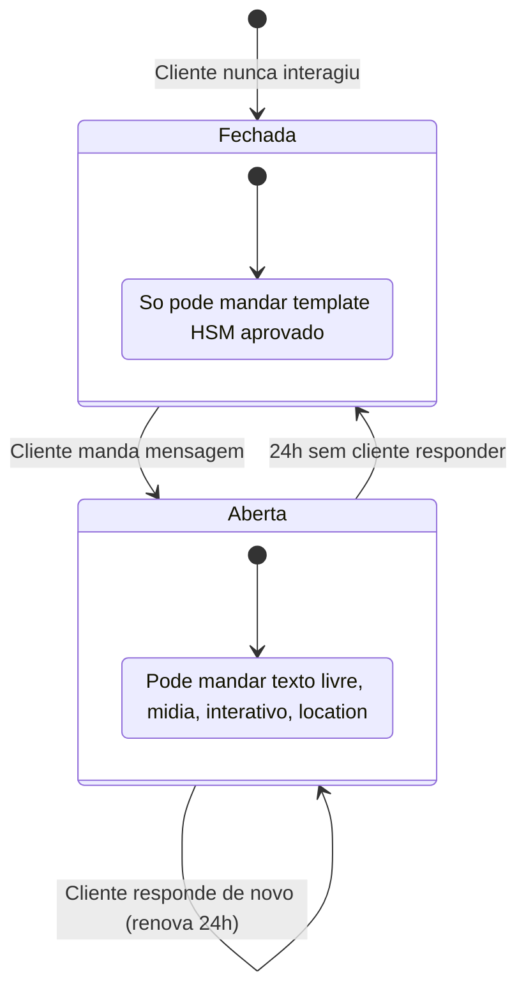

A **janela de 24h** (service window) é o mecanismo central da WhatsApp Business API. Define quando você pode falar livremente vs quando precisa de template aprovado. Errar isso é o motivo nº 1 de "minha mensagem não saiu".

## Como funciona



A janela **reabre** sempre que o cliente responde. Cada nova mensagem do cliente "renova" os 24h.

<Note>
  É **a partir da última mensagem do cliente**, não da sua. Se você mandou template e ele não respondeu, a janela continua fechada.
</Note>

## Como abrir a janela

Pra abrir uma janela com cliente que nunca falou com você:

1. **Manda template HSM aprovado** (única forma de iniciar conversa)
2. **Cliente responde** → janela abre

Não tem atalho. Você não pode "abrir janela" mandando primeiro texto livre.

## Como verificar status

Antes de mandar texto livre, você pode checar se a janela está aberta:

```bash
curl -X POST https://api.ararahq.com/api/v1/conversations/window-status \
  -H "Authorization: Bearer ara_live_xxx" \
  -d '{ "phones": ["+5511999999999", "+5511888888888"] }'
```

Resposta:

```json
{
  "+5511999999999": {
    "status": "OPEN",
    "openedAt": "2026-05-18T10:00:00Z",
    "expiresAt": "2026-05-19T10:00:00Z",
    "minutesRemaining": 1184
  },
  "+5511888888888": {
    "status": "CLOSED",
    "lastInteractionAt": "2026-05-15T14:00:00Z"
  }
}
```

Limite: até **200 números por chamada**. Pra mais, batch.

## O que acontece se você tentar mandar texto fora da janela

API retorna 422 com:

```json
{
  "error": {
    "code": "OUTSIDE_SESSION_WINDOW",
    "message": "Cannot send free-form message. Window closed at 2026-05-15T14:00:00Z. Use a template instead.",
    "details": {
      "lastInteractionAt": "2026-05-15T14:00:00Z",
      "windowClosedAt": "2026-05-16T14:00:00Z"
    }
  }
}
```

Você ajusta o código pra fallback em template.

## Reply automático com fallback

Padrão recomendado no inbox:

```typescript
async function reply(phone: string, text: string) {
  const status = await sdk.conversations.windowStatus([phone]);
  
  if (status[phone].status === 'OPEN') {
    // Texto livre dentro da janela
    return sdk.messages.send({
      receiver: `whatsapp:${phone}`,
      body: text,
    });
  } else {
    // Janela fechada — manda template "retomada" e armazena texto pra próxima resposta
    await sdk.messages.send({
      receiver: `whatsapp:${phone}`,
      templateName: 'retomada_atendimento',
      templateVariables: ['Olá'],
    });
    pendingReplies.set(phone, text);
  }
}
```

Quando cliente responder ao template "retomada", a janela abre e você manda o texto que estava pendente.

## Quando NÃO importa a janela

Templates **categoria AUTHENTICATION** (OTP) podem ser enviados a qualquer momento, independente da janela. Por design — código de verificação não pode esperar.

## Conversation pricing (descontinuado)

<Note>
  **Importante histórico**: até meados de 2025, a Meta cobrava por "conversa" (janela de 24h aberta). Hoje cobra **por mensagem entregue**. Documentação antiga que fala em "conversation pricing" está obsoleta. Ver [Pricing](/concepts/pricing).
</Note>

Por conta dessa mudança, a estratégia também mudou:

- **Antes**: vale a pena enviar muitos templates pra abrir janelas, depois usar texto livre dentro de cada uma (custo só na abertura)
- **Agora**: cada mensagem custa, dentro ou fora da janela. Manter janela aberta artificialmente não economiza.

## Casos de borda

### Cliente responde mas a Meta atrasa

Se cliente respondeu há 30s mas o webhook ainda não chegou na Arara, `window-status` pode dizer `CLOSED`. Solução: espere alguns segundos OU faça retry quando receber `OUTSIDE_SESSION_WINDOW`.

### Cliente respondeu durante seu dispatcher

Cenário: você está numa campanha disparando templates. Cliente A respondeu no meio. Próximo template pra ele provavelmente vai duplicar (template + texto livre na janela).

Solução: marca como `OPENED` no seu banco quando recebe `message.received`, e seu dispatcher checa antes.

### Janela aberta por outra equipe

Se sua organização tem múltiplas equipes operando o mesmo número, a janela é compartilhada. Atendimento responder libera marketing. Coordene.

## Próximos passos

<CardGroup cols={2}>
  <Card title="Templates HSM" icon="file-lines" href="/concepts/templates">
    O que mandar fora da janela.
  </Card>
  <Card title="Receita: Inbox" icon="users" href="/recipes/inbox-support">
    Operar atendimento com múltiplos atendentes.
  </Card>
</CardGroup>
