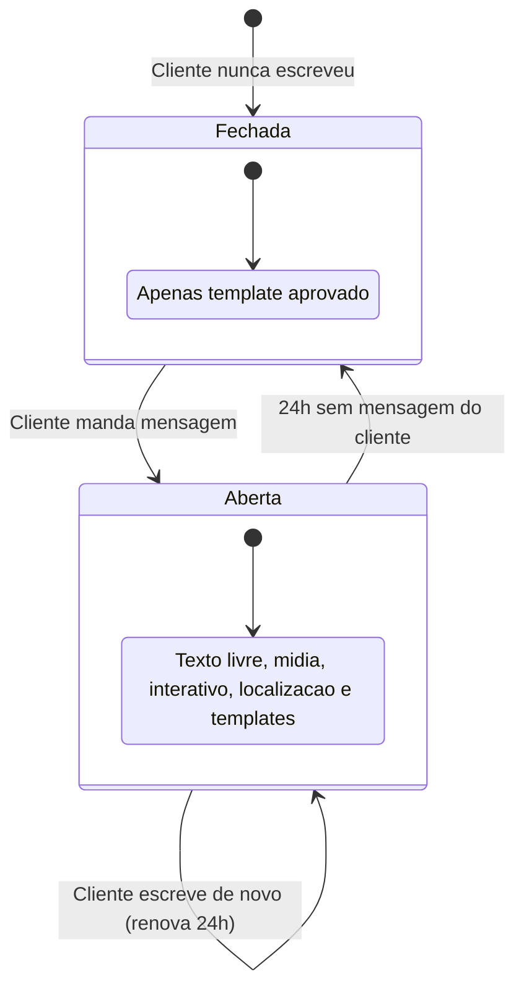

A **janela de 24h** (customer service window) é a regra da Meta que define quando a empresa pode mandar mensagem livre e quando precisa de template aprovado. Errar isso é o motivo mais comum de "minha mensagem não saiu".

## Como funciona


```mermaid
stateDiagram-v2
    [*] --> Fechada: Cliente nunca escreveu
    Fechada --> Aberta: Cliente manda mensagem
    Aberta --> Aberta: Cliente escreve de novo (renova 24h)
    Aberta --> Fechada: 24h sem mensagem do cliente

    state Aberta {
        [*] --> Livre
        Livre: Texto livre, midia, interativo, localizacao e templates
    }

    state Fechada {
        [*] --> SoTemplate
        SoTemplate: Apenas template aprovado
    }
```

A contagem parte da **última mensagem do cliente**, não da sua. Cada nova mensagem dele renova as 24h.

<Note>
  Mandar template não abre a janela. Ela só abre quando o cliente responde.
</Note>

**Template aprovado pode ser enviado a qualquer momento**, com a janela aberta ou fechada, em qualquer categoria. O que a janela controla é o envio de conteúdo que não é template: texto livre, mídia, mensagem interativa, localização e reação.

## Como abrir a janela

Com um cliente que nunca falou com você, ou que está sem responder há mais de 24h:

1. Envie um **template aprovado**.
2. O cliente **responde**: a janela abre.

Não existe outro caminho. Texto livre com a janela fechada é recusado.

## Como verificar o status

Antes de mandar texto livre, consulte a janela de até **200 números por chamada**:

```bash
curl -X POST https://api.ararahq.com/v1/conversations/window-status \
  -H "Authorization: Bearer ara_live_xxx" \
  -H "Content-Type: application/json" \
  -d '{ "phones": ["+5511999999999", "+5511888888888"] }'
```

Resposta:

```json
{
  "results": [
    {
      "phone": "+5511999999999",
      "isWindowOpen": true,
      "windowExpiresAt": "2026-09-16T10:00:00Z",
      "hoursRemaining": 19.7,
      "conversationId": "3f0c2a8e-6d1b-4a5e-9c47-1b2e8f9a0d11"
    },
    {
      "phone": "+5511888888888",
      "isWindowOpen": false,
      "windowExpiresAt": null,
      "hoursRemaining": null,
      "conversationId": null
    }
  ],
  "truncated": false
}
```

Se você mandar mais de 200 números, a resposta considera os 200 primeiros e traz `truncated: true`.

## Texto livre com a janela fechada

A API recusa com **HTTP 422**:

```json
{
  "error": {
    "code": "CONVERSATION_WINDOW_CLOSED",
    "message": "A janela de 24h com whatsapp:+5511999999999 esta fechada. Use um template aprovado para reabrir.",
    "details": {
      "receiver": "whatsapp:+5511999999999"
    }
  }
}
```

Trate esse código com fallback para template.

## Resposta com fallback

Padrão recomendado para atendimento:

```typescript
async function reply(phone: string, text: string) {
  const status = await sdk.conversations.windowStatus([phone]);
  const item = (status.results as Array<{ phone: string; isWindowOpen: boolean }>)
    .find((r) => r.phone === phone);

  if (item?.isWindowOpen) {
    return sdk.messages.send({
      receiver: `whatsapp:${phone}`,
      body: text,
    });
  }

  // Janela fechada: envia template de retomada e guarda o texto para quando o cliente responder
  await sdk.messages.send({
    receiver: `whatsapp:${phone}`,
    templateName: 'retomada_atendimento',
    templateVariables: ['Olá'],
  });
  pendingReplies.set(phone, text);
}
```

Quando o cliente responder ao template, a janela abre e você envia o texto pendente.

## Janela e custo

- **Template**: paga a tarifa Meta da categoria (MARKETING, UTILITY ou AUTHENTICATION), dentro ou fora da janela.
- **Texto livre dentro da janela**: a Meta não cobra. A carteira paga só o custo do provedor.
- **Mensagem recebida do cliente**: a carteira paga só o custo do provedor.

Valores em [Preços](/concepts/pricing).

## Casos de borda

### O cliente respondeu, mas o evento ainda não chegou

Se o cliente respondeu há poucos segundos e o evento ainda não foi processado, `window-status` pode vir fechado. Espere alguns segundos ou tente de novo ao receber `CONVERSATION_WINDOW_CLOSED`.

### O cliente respondeu no meio de uma campanha

Durante um disparo, um cliente pode responder e abrir a janela. Marque a conversa como aberta ao receber o webhook `message.received` e faça o seu disparador consultar esse estado antes de enviar o próximo template para a mesma pessoa.

### Mais de uma equipe no mesmo número

A janela é por número da empresa e cliente. Se atendimento e marketing usam o mesmo número, a resposta do cliente para um libera texto livre para o outro. Coordene.

## Próximos passos

<CardGroup cols={2}>
  <Card title="Templates" icon="file-lines" href="/concepts/templates">
    O que mandar fora da janela.
  </Card>
  <Card title="Receita: caixa de entrada" icon="users" href="/recipes/inbox-support">
    Atendimento com vários atendentes.
  </Card>
</CardGroup>
