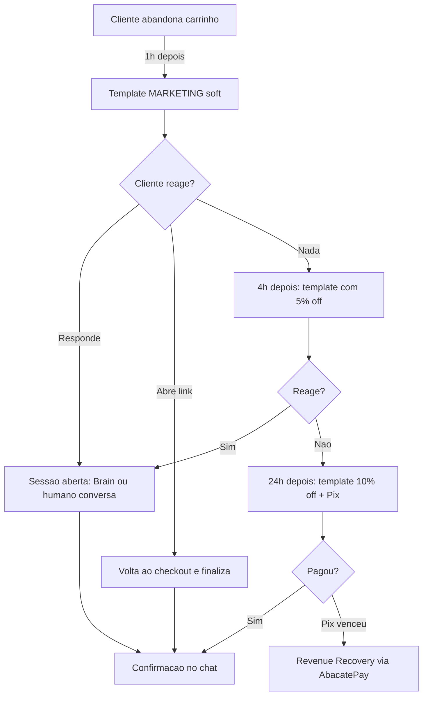

A receita mais importante de WhatsApp pra e-commerce. Operações que rodam ela bem recuperam **8-18% dos carrinhos abandonados** — em uma loja de R$ 500K/mês, isso é R$ 40-90K de receita adicional.

Esta receita é completa: detecção, template, fluxo de desconto progressivo, recuperação de Pix vencido, atribuição. Código pra 3 stacks (Shopify, WooCommerce, custom).

## O que você vai construir



## Pré-requisitos

- Template MARKETING aprovado pra carrinho abandonado (a Arara cria automaticamente quando você liga a integração)
- Webhook configurado
- Plano com [Brain Actions](/actions) (se quiser desconto progressivo automatizado)
- (Opcional) [AbacatePay configurado](/brain/actions/abacate-pix) pra Pix

## Detecção do abandono

### Shopify (automático)

```bash
# No dashboard Arara:
# Integrações → Shopify → Conectar (com Admin API token)
# → marcar "Carrinho abandonado" no checkbox de eventos
```

A Arara assina o webhook `checkouts/create` da Shopify e dispara o template após N minutos (configurável). Ver [integração Shopify](/integracoes/shopify).

### WooCommerce (plugin oficial em fase de release)

Capture o evento quando o cliente abandona (ex: passou 30min sem voltar ao checkout) e dispare pra Arara:

```php
// WooCommerce — exemplo simplificado
add_action('woocommerce_cart_abandoned', function($cart) {
    $customer = wp_get_current_user();
    wp_remote_post('https://api.ararahq.com/api/webhook/cart', [
        'headers' => [
            'Authorization' => 'Bearer ' . ARARA_API_KEY,
            'Content-Type' => 'application/json',
        ],
        'body' => json_encode([
            'event' => 'cart.abandoned',
            'name' => $customer->first_name,
            'phone' => $customer->billing_phone,
            'total' => $cart->total,
            'checkout_url' => wc_get_checkout_url(),
            'minutes_without_payment' => 30,
        ]),
    ]);
});
```

### Stack custom (Node/Next.js)

```typescript
await fetch('https://api.ararahq.com/api/webhook/cart', {
  method: 'POST',
  headers: {
    'Authorization': `Bearer ${process.env.ARARA_API_KEY}`,
    'Content-Type': 'application/json',
  },
  body: JSON.stringify({
    event: 'cart.abandoned',
    name: customer.firstName,
    phone: customer.phone,
    total: totalInReais,
    checkout_url: `https://meusite.com/checkout?cart=${cartId}`,
    minutes_without_payment: 30,
  }),
});
```

| Campo | Tipo | Obrigatório | Descrição |
|---|---|---|---|
| `event` | string | sim | `cart.abandoned`, `payment.failed`, `pix.created` ou `boleto.due` |
| `phone` | string | sim | E.164 do cliente |
| `checkout_url` | string | sim | Link pro cliente retomar |
| `name` | string | não | Nome do cliente (vai como variável do template) |
| `total` | number | não | Valor do carrinho em reais |
| `minutes_without_payment` | integer | não | Quanto tempo sem pagar (usado pra ranqueamento) |
| `pix_qr_code` | string | não | Obrigatório quando `event: pix.created` |

Cancelar lembrete depois que o cliente finalizou: **não há endpoint pra cancelar**. Em vez disso, configure no template um link encurtado por checkout — quando o pedido converte, atualize o status no seu lado pra não disparar próximos eventos.

## Template MARKETING

A Arara cria automaticamente na integração, mas se quer customizar:

```bash
curl -X POST https://api.ararahq.com/api/v1/templates \
  -H "Authorization: Bearer ara_live_xxx" \
  -d '{
    "name": "carrinho_abandonado_v1",
    "category": "MARKETING",
    "language": "pt_BR",
    "body": "Oi {{1}}! 👋\n\nVi que você ficou com {{2}} no carrinho. Quer finalizar agora?\n\nFinalizar: {{3}}",
    "samples": ["João", "uma camiseta básica", "https://meusite.com/c/abc"],
    "buttons": [
      { "type": "URL", "text": "Finalizar pedido", "url": "https://meusite.com/c/{{1}}" }
    ]
  }'
```

Tom soft no primeiro disparo. Sem urgência, sem caps, sem "ÚLTIMA CHANCE". Quem responder é qualified lead pra atendimento.

## Fluxo de desconto progressivo

A Arara não tem agendador interno de "wait 4h, depois manda template B". O fluxo escalonado roda do seu lado — cron que dispara um `POST /webhook/cart` por etapa, ou um endpoint de recovery vinculando cada `eventType` a um template:

```bash
# Vincula um template por tipo de evento (ver /recovery)
curl -X PUT https://api.ararahq.com/api/v1/recovery/events/cart.abandoned \
  -H "Authorization: Bearer ara_live_xxx" \
  -d '{
    "templateId": "ara_tpl_carrinho_v1",
    "active": true,
    "variableMapping": { "1": "$.name", "2": "$.total", "3": "$.checkout_url" }
  }'
```

Cada job seu (cron de 1h, 4h, 24h) bate `POST /webhook/cart` com o `event` correspondente. Quem cancela a sequência é a sua aplicação (quando o pedido fecha ou o cliente responde).

## Recovery de Pix vencido

Se o cliente clicou no link, foi pro checkout, gerou Pix mas **não pagou**, dispara recovery via AbacatePay. Setup em [Revenue Recovery](/recovery).

Fluxo típico orquestrado do seu lado:

```
T+0min:    Cliente abandona carrinho
T+60min:   POST /webhook/cart { event: "cart.abandoned" }
T+4h:      POST /webhook/cart { event: "cart.abandoned" } com template de 5% off
T+24h:     POST /webhook/cart com 10% off + Pix gerado pré-aprovado
T+24h45m:  PUT /v1/recovery/events/pix.created — Arara reaborda se Pix tá pra vencer
T+72h:     Stop (sua aplicação para de disparar)
```

## Métricas pra acompanhar

Dashboard Arara → **Recuperação → Carrinho abandonado**:

| Métrica | Bom benchmark |
|---|---|
| Taxa de entrega do template | > 95% |
| Taxa de leitura | > 80% |
| Click-through (template → checkout) | 15-30% |
| Conversão final (visto template → comprou) | 8-18% |
| Receita recuperada / mês | varia por volume |

Acompanhe semanalmente. Quedas indicam:
- Tier do número caindo (ver [Number quality](/concepts/number-quality))
- Template caindo de qualidade
- Mudança no checkout (link quebrado, UTM)

## Atribuição com Smart Links

Pra saber **quanto da sua receita** veio do WhatsApp:

```bash
# Configura webhook do Shopify/Woo pra notificar Arara quando pedido confirmar
# Dashboard → Smart Links → Integrações → Shopify

# Cada Smart Link criado pelo carrinho abandonado registra clique
# Quando o pedido confirma, a Arara cruza e atribui
```

Dashboard mostra: **"Carrinho abandonado v1 → 1.247 sends → 198 clicks → 47 pedidos → R$ 11.420 atribuídos"**.

Ver [Smart Links Attribution](/smart-links/attribution).

## Checklist de produção

- [ ] Template aprovado pela Meta (verifica via `GET /v1/templates/{id}/status`)
- [ ] Webhook do seu lado processando `message.received` (cliente respondeu)
- [ ] Sua aplicação para de disparar quando o pedido fecha
- [ ] Sua aplicação para de disparar quando o cliente responde no WhatsApp
- [ ] Threshold mínimo configurado do seu lado (não vale a pena rodar pra carrinho de R$ 30)
- [ ] [Opt-out](/concepts/compliance) processado: cliente que pediu "Stop" não recebe
- [ ] Smart Link configurado pra atribuição
- [ ] Brain configurado pra responder dúvidas do produto se o cliente responder
- [ ] Monitora taxa de bloqueio nos primeiros 7 dias

## Quando NÃO usar essa receita

- **Ticket baixo (< R$ 50)**: custo de R$ 0,40-1,20 em mensagens pode comer toda a margem
- **Cliente que nunca consentiu em WhatsApp**: opt-in primeiro (e-mail), depois inclui na receita
- **Operação em estágio inicial sem warming**: comece com volume baixo, suba quality, depois ativa massivamente

## Próximos passos

<CardGroup cols={2}>
  <Card title="Revenue Recovery completo" icon="rotate-right" href="/recovery">
    Pix vencido, cartão recusado, falha de pagamento.
  </Card>
  <Card title="Smart Links" icon="link" href="/smart-links">
    Tracking de cada clique.
  </Card>
</CardGroup>
