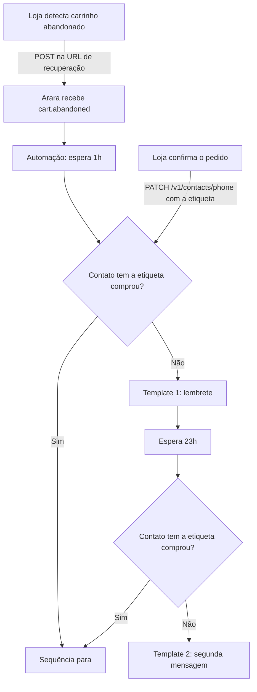

O seu e-commerce detecta o abandono e avisa a Arara. A Arara envia a mensagem pelo número da sua organização, com o template que você escolheu. Para mais de uma mensagem com intervalo entre elas, use uma automação.

A detecção do abandono é sempre do seu lado: a Arara não observa o checkout da loja.

## O que você vai construir


```mermaid
flowchart TD
    A["Loja detecta carrinho abandonado"] -->|POST na URL de recuperação| B["Arara recebe cart.abandoned"]
    B --> C["Automação: espera 1h"]
    C --> D{"Contato tem a etiqueta comprou?"}
    D -->|Sim| X["Sequência para"]
    D -->|Não| E["Template 1: lembrete"]
    E --> F["Espera 23h"]
    F --> G{"Contato tem a etiqueta comprou?"}
    G -->|Sim| X
    G -->|Não| H["Template 2: segunda mensagem"]
    I["Loja confirma o pedido"] -->|PATCH /v1/contacts/phone com a etiqueta| D
```

## Pré-requisitos

- Número de WhatsApp conectado na organização.
- Template MARKETING aprovado para cada mensagem da sequência (ver [Templates](/concepts/templates)).
- Recuperação e automações disponíveis no seu plano. Sem acesso, os endpoints `/v1/recovery/*` e `/v1/automations` respondem 403 com `PLAN_FEATURE_LOCKED`.

## 1. Pegue o endpoint de recuperação

Cada organização tem uma URL de ingestão própria. Busque pelo dashboard (**Recuperação**) ou pela API:

```bash
curl https://api.ararahq.com/v1/recovery/endpoint \
  -H "Authorization: Bearer ara_live_xxx"
```

```json
{
  "code": "ara_rec_...",
  "hmacSecret": "...",
  "active": false,
  "url": "https://.../l/ara_rec_..."
}
```

O endpoint nasce **desligado** (`active: false`). Enquanto estiver assim, os eventos são recusados com `403 RECOVERY_ENDPOINT_INACTIVE`. Ligue quando terminar a configuração:

```bash
curl -X PATCH https://api.ararahq.com/v1/recovery/endpoint \
  -H "Authorization: Bearer ara_live_xxx" \
  -H "Content-Type: application/json" \
  -d '{ "active": true }'
```

Guarde `url` e `hmacSecret` no servidor. O `hmacSecret` nunca deve ir para o navegador.

## 2. Envie o evento quando o carrinho for abandonado

Mande um `POST` para a `url` devolvida acima:

```typescript
import { createHmac } from 'node:crypto';

export async function notifyCartAbandoned(cart: {
  id: string;
  customerName: string;
  phone: string;        // E.164, ex.: +5511999999999
  totalFormatted: string;
  checkoutUrl: string;
}) {
  const body = JSON.stringify({
    phone: cart.phone,
    name: cart.customerName,
    variables: {
      nome: cart.customerName,
      valor: cart.totalFormatted,
      link: cart.checkoutUrl,
    },
  });

  const signature = createHmac('sha256', process.env.ARARA_RECOVERY_SECRET!)
    .update(body)
    .digest('hex');

  const response = await fetch(process.env.ARARA_RECOVERY_URL!, {
    method: 'POST',
    headers: {
      'Content-Type': 'application/json',
      'X-Arara-Event': 'cart.abandoned',
      'X-Arara-Idempotency-Key': `cart-${cart.id}`,
      'X-Arara-Signature': `sha256=${signature}`,
    },
    body,
  });

  return response.json(); // { ingestId, status, reason, messageId }
}
```

| Header | Obrigatório | Descrição |
|---|---|---|
| `X-Arara-Event` | sim | Nome do evento. Recuperação configurável: `cart.abandoned`, `payment.failed`, `pix.created`, `boleto.due`. |
| `X-Arara-Signature` | não | `sha256=` + HMAC-SHA256 do corpo cru com o `hmacSecret`. Quando enviado, é validado; assinatura errada é recusada. |
| `X-Arara-Idempotency-Key` | não | Mesmo valor para o mesmo evento. Repetir a chave devolve o resultado do primeiro processamento, sem novo envio. |

| Campo do corpo | Descrição |
|---|---|
| `phone` | Telefone do cliente. Inválido vira `REJECTED` com `INVALID_PHONE`. |
| `name` | Nome do cliente (opcional). |
| `variables` | Valores usados no template. A chave `link` é tratada à parte: vira o destino do botão de smart link do template. |

A resposta é `202` com `{ ingestId, status, reason, messageId }`. `status` pode ser:

| `status` | Significado |
|---|---|
| `SENT` | Mensagem enviada pela configuração de recuperação. `messageId` traz o `ara_msg_...`. |
| `ACCEPTED` | Recebido. `reason: HANDLED_BY_AUTOMATION` quando só uma automação tratou o evento. |
| `REJECTED` | Recusado. Ex.: `INVALID_PHONE`, `OPTED_OUT`, `EVENT_DISABLED`, `TEMPLATE_NOT_APPROVED`. |
| `FAILED` | Falhou. Ex.: `NO_TEMPLATE` (nenhum template nem automação para o evento), `UNKNOWN_EVENT`. |

Erros antes do processamento: `403 RECOVERY_ENDPOINT_INACTIVE` (endpoint desligado), `401 RECOVERY_HMAC_INVALID` (assinatura não confere), `400 RECOVERY_EVENT_INVALID` (sem `X-Arara-Event`) e `429 RECOVERY_RATE_LIMITED` (com header `Retry-After`).

<Note>
  A assinatura do endpoint de recuperação é HMAC do **corpo cru**, sem timestamp. É diferente dos [webhooks que a Arara envia para você](/webhooks), que assinam `"{timestamp}.{corpo}"`.
</Note>

## 3a. Uma mensagem só: configuração de recuperação

Para enviar um único template assim que o evento chega, vincule o template ao evento. Pelo dashboard em **Recuperação**, ou pela API:

```bash
curl -X PUT https://api.ararahq.com/v1/recovery/events/cart.abandoned \
  -H "Authorization: Bearer ara_live_xxx" \
  -H "Content-Type: application/json" \
  -d '{
    "templateId": "0b8f6c1e-7a52-4a1b-9a0e-3f2d6c9e1a44",
    "active": true
  }'
```

- `templateId` é o **id (UUID)** do template, não o nome.
- As variáveis do template são preenchidas com os valores de `variables` **em ordem alfabética da chave** (a chave `link` fica de fora). Com `nome` e `valor`, `{{1}}` recebe `nome` e `{{2}}` recebe `valor`.
- `variableMapping` (opcional) renomeia chaves do payload antes dessa ordenação: `{ "valor": "1", "nome": "2" }` troca a ordem. Use chaves de um dígito; `"10"` ordena antes de `"2"`.

Para validar sem esperar um carrinho real, `POST /v1/recovery/events/cart.abandoned/test` processa um payload de exemplo enviando para o telefone cadastrado no seu usuário. O endpoint precisa estar ligado.

## 3b. Sequência com espera: automação

Automações executam passos em ordem para cada contato que entra:

| Passo (`type`) | `config` | O que faz |
|---|---|---|
| `wait` | `{ "minutes": 60 }` | Espera de 1 minuto a 30 dias. |
| `condition` | `{ "tag": "comprou" }` | Continua **só se o contato ainda não tem** a etiqueta. Se tiver, a sequência para. |
| `message` | `{ "templateId": "<uuid>", "variables": ["nome", "link"] }` | Envia um template aprovado. `variables` lista as chaves do payload, na ordem de `{{1}}`, `{{2}}`... |
| `tag` | `{ "tag": "recebeu_lembrete" }` | Aplica uma etiqueta no contato. |

Monte pelo dashboard em **Automações**, ou pela API:

```bash
curl -X POST https://api.ararahq.com/v1/automations \
  -H "Authorization: Bearer ara_live_xxx" \
  -H "Content-Type: application/json" \
  -d '{
    "name": "Carrinho abandonado",
    "trigger": "cart.abandoned",
    "steps": [
      { "type": "wait", "config": { "minutes": 60 } },
      { "type": "condition", "config": { "tag": "comprou" } },
      { "type": "message", "config": { "templateId": "0b8f6c1e-7a52-4a1b-9a0e-3f2d6c9e1a44", "variables": ["nome", "link"] } },
      { "type": "wait", "config": { "minutes": 1380 } },
      { "type": "condition", "config": { "tag": "comprou" } },
      { "type": "message", "config": { "templateId": "5d2a9b7c-1e44-4f0a-8c3b-6a7e2d1f9b10", "variables": ["nome", "link"] } }
    ]
  }'
```

A automação nasce desligada. Ligue com:

```bash
curl -X PUT https://api.ararahq.com/v1/automations/{id}/active \
  -H "Authorization: Bearer ara_live_xxx" \
  -H "Content-Type: application/json" \
  -d '{ "active": true }'
```

O plano define quantas automações podem ficar ligadas ao mesmo tempo.

A mesma `X-Arara-Idempotency-Key` não inicia a automação duas vezes para o mesmo evento.

<Warning>
  O evento é entregue para as automações **e** para a recuperação de um passo. Se houver automação ativa para `cart.abandoned` e também um template vinculado ao evento (ou o template padrão `arara_recovery_cart_abandoned_pt_br` criado por `POST /v1/recovery/provision-defaults`), o cliente recebe as duas mensagens. Para usar só a automação, desligue o evento com `PUT /v1/recovery/events/cart.abandoned` e `{ "active": false }`. Nesse caso a resposta do `POST` vem `REJECTED` com `EVENT_DISABLED`, mesmo com a automação iniciada.
</Warning>

## 4. Pare a sequência quando o cliente comprar

Quando o pedido for confirmado, aplique a etiqueta usada no passo `condition`:

```bash
curl -X PATCH "https://api.ararahq.com/v1/contacts/%2B5511999999999" \
  -H "Authorization: Bearer ara_live_xxx" \
  -H "Content-Type: application/json" \
  -d '{ "tags": ["comprou"] }'
```

- `tags` **substitui** a lista inteira de etiquetas do contato. Leia as atuais com `GET /v1/contacts/{phone}` e envie a lista completa.
- O contato precisa existir na base da organização; se não existir, a API responde erro.
- O `+` do telefone vai codificado na URL (`%2B`).

Resposta do cliente no WhatsApp **não** para a sequência sozinha. Se quiser parar quando ele responder, escute o webhook `message.received` e aplique a etiqueta.

## Template de exemplo

```bash
curl -X POST https://api.ararahq.com/v1/templates \
  -H "Authorization: Bearer ara_live_xxx" \
  -H "Content-Type: application/json" \
  -d '{
    "name": "carrinho_abandonado_v1",
    "category": "MARKETING",
    "language": "pt_BR",
    "body": "Oi {{1}}, seu carrinho ficou salvo. Quer finalizar a compra?\n\n{{2}}",
    "samples": { "1": "João", "2": "https://meusite.com/checkout/abc" }
  }'
```

`samples` é um objeto com o número da variável como chave. O retorno traz o `id` (UUID) usado em `templateId`. Acompanhe a aprovação com `GET /v1/templates/{id}/status` ou pelo webhook `template.updated`.

Tom leve na primeira mensagem. Quem responde abre a janela de 24h e pode ser atendido por texto livre (ver [Atendimento com vários atendentes](/recipes/inbox-support)).

## Acompanhar resultados

- `GET /v1/recovery/stats?period=LAST_7D` (aceita `TODAY`, `YESTERDAY`, `LAST_7D`, `LAST_30D`): números agregados da recuperação.
- `GET /v1/recovery/ingests?event=cart.abandoned&status=REJECTED`: eventos recebidos, com motivo de recusa. `POST /v1/recovery/ingests/{id}/retry` reprocessa um deles.
- Webhook `message.status_updated`: status de cada mensagem (`sent`, `delivered`, `read`, `failed`).
- Três ou mais falhas/recusas em 5 minutos geram um alerta no dashboard.

## Checklist de produção

- [ ] Templates aprovados (`GET /v1/templates/{id}/status`)
- [ ] Endpoint de recuperação com `active: true`
- [ ] `hmacSecret` só no servidor e `X-Arara-Signature` em toda chamada
- [ ] `X-Arara-Idempotency-Key` derivada do id do carrinho
- [ ] Só uma via por evento: automação **ou** configuração de recuperação
- [ ] Etiqueta de compra aplicada quando o pedido fecha
- [ ] Webhook `message.received` tratado (cliente respondeu)
- [ ] Opt-out respeitado: eventos para contatos em `/v1/opt-outs` voltam `REJECTED` com `OPTED_OUT`
- [ ] Telefone normalizado em E.164 antes de enviar

## Próximos passos

<CardGroup cols={2}>
  <Card title="Revenue Recovery" icon="rotate-right" href="/recovery">
    Endpoint de recuperação e eventos de pagamento.
  </Card>
  <Card title="Shopify" icon="cart-shopping" href="/integracoes/shopify">
    Como ligar uma loja Shopify a este fluxo.
  </Card>
</CardGroup>
