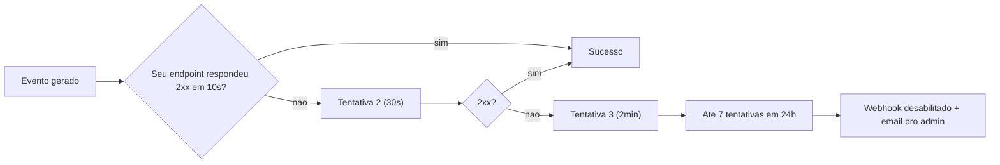

A Arara não tem "polling". Você configura uma URL no nosso dashboard, e a gente avisa seu backend assim que algo acontece — mensagem entregue, lida, cliente respondeu, pagamento confirmado. Tudo via webhook, com HMAC pra você validar que veio mesmo da gente.

<CardGroup cols={2}>
  <Card title="Eventos disponíveis" icon="list" href="/webhooks/events">
    Catálogo completo dos eventos que a Arara envia, com payload de cada um.
  </Card>
  <Card title="Receitas em Laravel/Next" icon="code">
    [Laravel](/integracoes/laravel#webhook) · [Next.js](/integracoes/nextjs#webhook)
  </Card>
</CardGroup>

## Como configurar

Dashboard → **Configurações → Webhooks → URL** + secret.

Ou via API:

```bash
curl -X PATCH https://api.ararahq.com/api/organizations/me/webhook \
  -H "Authorization: Bearer ara_live_xxx" \
  -d '{
    "url": "https://meusite.com.br/api/webhooks/arara",
    "secret": "share_a_random_secret_with_us"
  }'
```

O `secret` é compartilhado: você guarda do seu lado, a gente assina com ele. Mínimo 32 caracteres recomendado.

## Envelope universal

Todo evento da Arara vem no mesmo formato:

```json
{
  "event": "message.status_updated",
  "apiVersion": "1",
  "timestamp": "2026-05-18T14:32:11.123Z",
  "organizationId": "0e4f3c1e-...",
  "data": {
    "id": "ara_msg_k9Bf2XqP",
    "status": "delivered",
    "receiver": "+5511999999999",
    "sender": "+5511888888888"
  }
}
```

Campos sempre presentes:

| Campo | Tipo | Descrição |
|---|---|---|
| `event` | string | Tipo do evento. Ver [catálogo](/webhooks/events). |
| `timestamp` | ISO-8601 | Quando o evento aconteceu no nosso lado. |
| `organizationId` | string | Sua organização. Útil se você consolida múltiplos orgs. |
| `data` | object | Payload específico do evento. |

## Validação HMAC

Cada request vem com headers:

```
X-Arara-Signature: a4f9b8c2...                      (HMAC-SHA256 hex)
X-Arara-Event: message.status                       (mesma do body)
X-Arara-Webhook-Id: ara_evt_xxx                     (ID único do evento)
X-Arara-Timestamp: 1716040331                        (Unix seconds)
```

Pra validar:

```javascript
import { createHmac, timingSafeEqual } from 'node:crypto';

function isValid(rawBody, signatureHeader, secret) {
  const expected = createHmac('sha256', secret).update(rawBody).digest('hex');
  return (
    expected.length === signatureHeader.length &&
    timingSafeEqual(Buffer.from(expected), Buffer.from(signatureHeader))
  );
}
```

```php
function isValid(string $rawBody, string $signature, string $secret): bool {
    $expected = hash_hmac('sha256', $rawBody, $secret);
    return hash_equals($expected, $signature);
}
```

```python
import hmac, hashlib

def is_valid(raw_body: bytes, signature: str, secret: str) -> bool:
    expected = hmac.new(secret.encode(), raw_body, hashlib.sha256).hexdigest()
    return hmac.compare_digest(expected, signature)
```

<Warning>
  **Sempre use comparação constant-time** (`timingSafeEqual`, `hash_equals`, `hmac.compare_digest`). Comparação simples (`==`) é vulnerável a timing attack — atacante mede tempo de resposta byte a byte pra adivinhar a signature.
</Warning>

## Dedupe

A Meta retenta agressivamente. Você vai receber o mesmo evento múltiplas vezes em alguns casos. Use o header `X-Arara-Webhook-Id` (único por evento) pra fazer dedupe no seu lado:

```sql
INSERT INTO arara_webhook_events (id, event, received_at)
VALUES ('ara_evt_xxx', 'message.status_updated', NOW())
ON CONFLICT (id) DO NOTHING
RETURNING *;
```

Se a query não retornou linha, é duplicata — ignora.

## Retry e backoff



Se seu endpoint não responder **2xx em 10 segundos**, a Arara retenta com backoff exponencial:

| Tentativa | Espera |
|---|---|
| 1ª | imediato |
| 2ª | 30s |
| 3ª | 2min |
| 4ª | 10min |
| 5ª | 1h |
| 6ª | 6h |
| 7ª | 24h |

Após 7 tentativas falhadas em 24h, o webhook é **desabilitado** e você recebe email + sino no dashboard. Pra reativar:

```bash
curl -X POST https://api.ararahq.com/api/organizations/me/webhook/reenable \
  -H "Authorization: Bearer ara_live_xxx"
```

<Note>
  Endpoint precisa responder **2xx em 10s**. Se a sua lógica é cara (banco, ML), responde 200 imediato e enfileira o processamento. Webhook NÃO é lugar de fazer trabalho pesado síncrono.
</Note>

## Ordem

A Arara entrega eventos **na ordem em que os estados mudam** (queued → sent → delivered → read), mas **sem garantia global de ordem** entre mensagens diferentes. Seu handler precisa ser idempotente — em casos raros um `status_updated` pode chegar fora de ordem.

## Eventos disponíveis

| Evento | Quando |
|---|---|
| `message.status_updated` | Status de uma mensagem outbound mudou (`queued`, `sent`, `delivered`, `read`, `failed`, `canceled`, `processing`, `scheduled`). |
| `message.received` | Cliente respondeu / iniciou conversa. **Só dispara em número dedicado.** |
| `template.updated` | Status de template mudou (aprovado, rejeitado, pausado). |
| `campaign.completed` | Campanha terminou de processar todos os contatos. |
| `conversation.needs_human` | Brain decidiu escalar a conversa pra atendente humano. |
| `webhook.test` | Evento sintético do botão "Testar" no dashboard. Valida URL + HMAC sem efeito colateral. |

Catálogo completo com schema de payload por evento em [Eventos](/webhooks/events).

<Warning>
  **Inbound só em número dedicado.** Se sua org está no pool de números compartilhados, a Arara não consegue rotear mensagens inbound pra você — o webhook `message.received` não dispara. Os outros 5 eventos funcionam normalmente. Pra habilitar inbound completo, [solicite um número dedicado](/numbers#pedir-um-número-dedicado).
</Warning>

## Próximos passos

<CardGroup cols={2}>
  <Card title="Eventos detalhados" icon="list-check" href="/webhooks/events">
    Schema completo de cada payload.
  </Card>
  <Card title="Receita: webhooks Laravel" icon="php" href="/integracoes/laravel#webhook">
    Controller pronto com HMAC validation.
  </Card>
</CardGroup>
